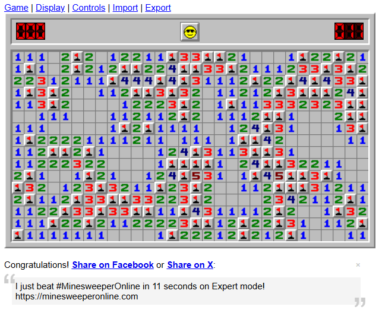
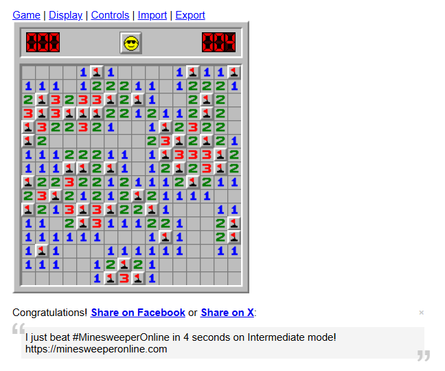
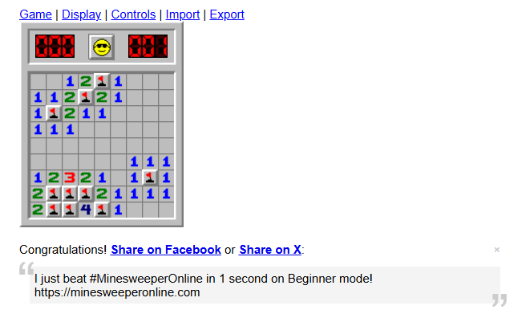

# minesweeper
Minesweeper solver

https://minesweeperonline.com/

Самый платформо-зависимый код на свете(скорее всего)

1) Нужно зайти на сайт и выбрать Display/Position/Left
2) Каким то образом вам надо настроить screen/screen.go FirstPoint, которая должна указывать на верхний левый угол верхнего левого игрового поля
3) Если по каким-то причинам размер игровой клетки у вас не 20х20 это необходимо поменять в settings/settings BlockSize
4) Режим игры выбирается через аргументы командной строки -b/-beginner, -i/intermediate, -e/-expert

Beginner mode решает стабильно, intermediate через раз, expert очень редко, возможно при добавлении поиска более сложных паттернов результаты улучшатся

Ассинхронность и гига-оптимизации разбились об задержку отображения информации сайтом после клика (которая у меня составляла около 30мс)

Результаты:

